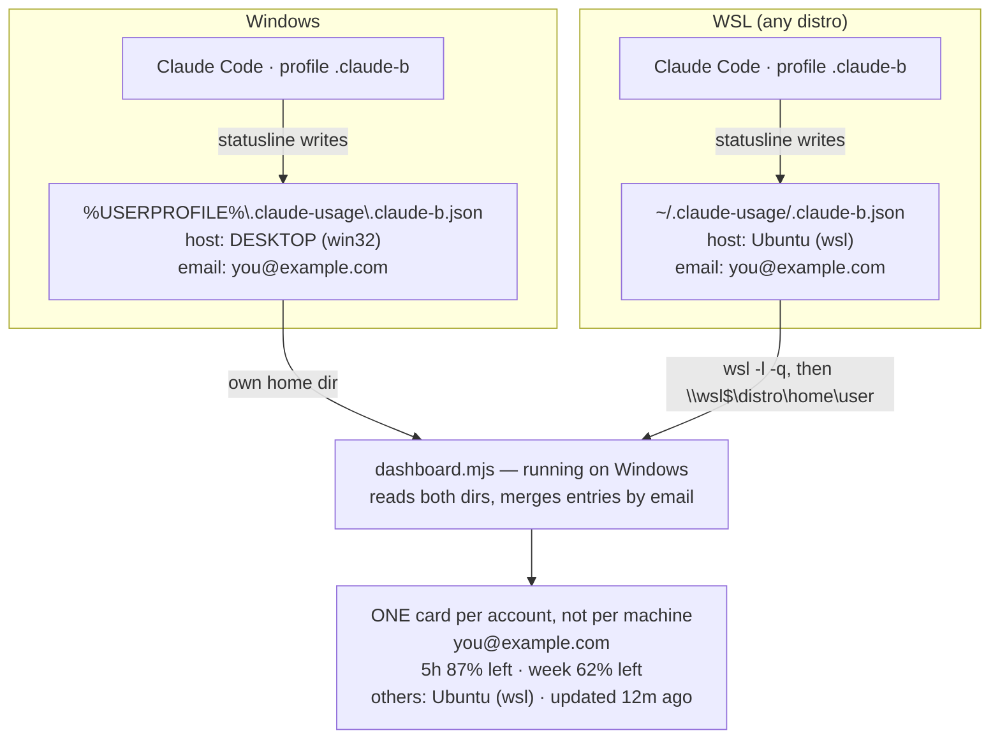

# Claude Code 額度狀態列

[English](README.md) · **繁體中文**

一個 [Claude Code](https://claude.com/claude-code) 狀態列,在每次輸入時一眼看見目前模型、它的**思考層級**,以及訂閱方案的 **5 小時與每週額度**及重置倒數。

```
Opus 4.8·high | 5h 剩 87% (3h12m) | 週 剩 62% (4d6h)
```

模型名後面的 `·high` 是目前的思考層級(`low` / `medium` / `high` / `xhigh` / `max`)——層級愈高愈耗額度,所以放在這裡很實用。模型不支援思考參數時會自動省略。

資料直接讀取 Claude Code 餵給狀態列的 JSON(`rate_limits` 與 `effort`)。**不呼叫 API、不需金鑰。**

## 特色

- **Windows 原生可用** — CMD/PowerShell 與 macOS、Linux、WSL 皆可,毋須 bash 或 `jq`。
- **零相依** — 純 Node.js,沒有要 `npm install` 的東西。
- **單一檔** — 整個安裝器就是一個 `install.mjs`,可直接 `curl | node` 一鍵安裝。
- **自選區段** — 自由選擇要顯示哪些部分(模型、思考層級、額度、帳號),安裝前可先預覽。見[自訂區段](#自訂區段)。
- **不破壞既有設定** — 合併進 `~/.claude/settings.json`,保留你原本的設定。

## 三步驟安裝

**1.** 先確認裝了 [Node.js](https://nodejs.org)(在終端機輸入 `node --version`,有跑出版本號就 OK)。

**2.** 複製對應你系統的那一行,貼到終端機按 Enter(這裡是**中文版**指令):

- **macOS / Linux / WSL** — 貼進 Terminal:

  ```bash
  curl -fsSL https://raw.githubusercontent.com/nyannyn/claude-code-usage-statusline/main/install.mjs | node - zh
  ```

- **Windows** — 貼進 PowerShell:

  ```powershell
  $env:CLAUDE_SL_LANG="zh"; irm https://raw.githubusercontent.com/nyannyn/claude-code-usage-statusline/main/install.ps1 | iex
  ```

**3.** 完全關閉 Claude Code 再重新打開。完成 — 送出第一則訊息後就會顯示額度。

> 想要英文狀態列?用 [English README](README.md) 裡的指令。

## 自訂區段

用逗號分隔的清單,自由決定要顯示哪些部分、以及順序(由左到右):

| 區段      | 顯示內容                                                       |
| --------- | ------------------------------------------------------------ |
| `model`   | 模型名稱(例 `Opus 4.8`)                                     |
| `effort`  | 思考層級——以 `·high` 形式接在模型後。層級愈高愈耗額度          |
| `5h`      | 5 小時額度剩餘 + 重置倒數                                     |
| `week`    | 每週額度剩餘 + 重置倒數                                       |
| `account` | 帳號簡稱(Claude 登入 email 中 `@` 前的部分)                 |
| `email`   | 完整帳號 email                                               |
| `ctx`     | context window 用掉幾 %                                      |
| `tokens`  | 本次 session 燒掉的 token——輸出,以及新輸入(input + cache creation,不含 cache 讀取)。含 subagent 的回合 |
| `cost`    | 本次 session 花費美金(Claude Code 自己算的數字)              |

預設為 `model,effort,5h,week`;`all` 等於 `model,effort,5h,week,account,ctx,tokens,cost`。
`account` / `email` 直接讀你既有的 `~/.claude.json`,不會送往任何地方。

**放不下就換兩行。** 清單裡有 `ctx` 時,一行塞不進終端機寬度就會把 `ctx` 以後的段落
移到第二行;視窗拉寬又會變回一行。Claude Code 每次渲染前都會設好 `COLUMNS`,所以
拉伸視窗會自動跟著變,不用設定。

**顏色負責分層。** 標籤是暗字、數字保持亮白,整行才有落點,不會八個欄位一樣大聲;
兩個百分比依「還剩多少空間」上綠/黃/紅(額度看剩餘,`ctx` 看還沒用掉的部分)。
這兩個百分比方向相反——額度是**剩下**幾 %,`ctx` 是**用掉**幾 %——所以各自把
「剩」「用」寫在標籤裡。`NO_COLOR=1` 可全部關掉;寬度計算前會先剝掉跳脫碼,
所以顏色不佔任何一欄。

> **多視窗使用 `account` / `email` 請注意。** 狀態列 JSON 沒有帳號欄位,而
> `~/.claude.json` 只存**最後一次登入**的帳號,所以同時開多個登入不同帳號的視窗時,
> 它們會全部顯示同一個帳號。要讓各視窗顯示正確帳號,啟動該視窗的 Claude Code 前先設
> `CLAUDE_SL_ACCOUNT`(例如 `CLAUDE_SL_ACCOUNT=work@acme.com claude`),或讓每個帳號
> 各用自己的 `CLAUDE_CONFIG_DIR`。腳本的判斷順序:先看 `CLAUDE_SL_ACCOUNT`,再看
> `CLAUDE_CONFIG_DIR` 下的 `.claude.json`,最後才是 `~/.claude.json`。

> **`tokens` 算的是什麼。** Claude Code 餵給狀態列的只有 context window 的當下快照,
> 沒有累計值,所以這一段是自己去讀 session 的 transcript 加總,並把「讀到第幾個 byte」
> 記在 `<usage dir>/sessions/` 底下——之後每次刷新只讀新增的那幾 KB。計入的是
> **輸出 + 新輸入**(input + cache creation),刻意不算 cache 讀取(每回合重送同一份
> 快取提示不算新工作);subagent 的回合有算進去。所以這個數字會比「把 cache 讀取
> 也算進去」的工具小。

**安裝前先預覽。** `demo` 旗標會用假資料渲染一行範例,不需要 Claude Code:

```bash
node statusline-limits.mjs zh all demo
# Opus 4.8·high | 5h 剩 87% (3h12m) | 週 剩 62% (4d6h) | 你的帳號名

node statusline-limits.mjs zh model,effort,5h,week,email demo
# Opus 4.8·high | 5h 剩 87% (3h12m) | 週 剩 62% (4d6h) | you@example.com
```

把選好的區段接在安裝指令後面即可:

```bash
# macOS / Linux / WSL
curl -fsSL https://raw.githubusercontent.com/nyannyn/claude-code-usage-statusline/main/install.mjs | node - zh all
```

```powershell
# Windows
$env:CLAUDE_SL_LANG="zh"; $env:CLAUDE_SL_SEGMENTS="all"; irm https://raw.githubusercontent.com/nyannyn/claude-code-usage-statusline/main/install.ps1 | iex
```

> **用 AI agent 幫你設定?** 叫它讀 [`AGENTS.md`](AGENTS.md)——裡面會指示 agent 列出區段選單、渲染預覽,再依你的選擇安裝。

## 多帳號儀表板

同時養好幾個 Claude 訂閱帳號(例如每個帳號各一個 `CLAUDE_CONFIG_DIR`)?儀表板讓你在瀏覽器裡**一頁看齊所有帳號的 5 小時與每週額度**——每個帳號一張卡(跨機器以 email 合併,單一扁平清單):用量條、重置倒數、email/方案/模型、資料新鮮度,每 30 秒自動更新。若同一帳號也登入在另一台機器(或 WSL),那份不會另開一張卡,而是併進主卡底下的「其他」狀態列。

**現在就試**(假資料、不讀任何東西、免安裝):

```bash
curl -fsSL https://raw.githubusercontent.com/nyannyn/claude-code-usage-statusline/main/dashboard.mjs | node - zh demo
```

```powershell
# Windows PowerShell
irm https://raw.githubusercontent.com/nyannyn/claude-code-usage-statusline/main/dashboard.mjs | node - zh demo
```

**真實用量三步驟:**

1. 每個帳號各給一個 config 目錄,各登入一次:`CLAUDE_CONFIG_DIR=~/.claude-b claude`
2. 安裝狀態列(本 README 開頭)——安裝器現在會一併把 `dashboard.mjs` 放進 `~/.claude/`;Windows 上還會**在桌面建「Claude 用量儀表板」捷徑**,macOS/Linux 則印出可直接貼進 shell rc 的 `claude-usage` alias。
3. 啟動——雙擊捷徑、用 alias,或跑上面那行一鍵指令(拿掉 `demo`;閒置帳號想看即時數字就加 `--live`):

```bash
node ~/.claude/dashboard.mjs zh           # 純快照,零 API 呼叫
node ~/.claude/dashboard.mjs zh --live    # + 向 Anthropic 查沒開視窗的帳號
```

**資料來源有兩種,依帳號合併:**

1. **快照(預設,零 API 呼叫)。** 狀態列每次渲染時,順手把該 profile 最新的 `rate_limits` 寫進 `~/.claude-usage/<profile>.json`,儀表板只讀這些檔案。資料新鮮度等於你在該帳號視窗最後一次送訊息的時間;超過 15 分鐘沒更新會標示「資料過舊」。Windows 上還會自動掃描每個 WSL distro 的 `~/.claude-usage`,原生與 WSL 視窗同頁顯示。啟動視窗前設 `CLAUDE_SL_ACCOUNT` 可讓該卡片顯示自訂名稱,不用目錄名。

2. **即時模式(`--live`,自行選用)。** 額外從各 `<config-dir>/.credentials.json` 讀取 OAuth token,直接向 Anthropic 的用量端點查詢——連沒開視窗的帳號也有即時數字。Token 不會離開你的機器(唯一的請求只發往 `api.anthropic.com`),但注意這是未文件化的端點且限流很兇,因此結果會快取 60 秒。Token 過期只有在該帳號**所有**副本都沒有可用 token 時才顯示紅字——只要任一台機器的 token 還有效,帳號本身就沒問題,失效的那份會在那台機器下次開 Claude Code 時自動刷新。

```bash
node dashboard.mjs zh --live         # 快照 + 即時查詢
node dashboard.mjs zh --port 8080    # 自訂 port
node dashboard.mjs zh --no-open      # 不自動開瀏覽器
node dashboard.mjs zh --takeover     # port 被占用時,請求該實例關閉(POST /api/shutdown)並接手
node dashboard.mjs zh --live --daemon  # 背景執行 — 關掉終端機也不會停
node dashboard.mjs zh --status       # 這個 port 有 daemon 在跑嗎?
node dashboard.mjs zh --stop         # 停掉它
```

**當成背景/開機常駐服務執行。** `--takeover` 讓你把儀表板註冊成開機啟動項目時,不用擔心「port 已被占用」——新實例會對現有實例發送 `/api/shutdown`,等它結束後再自己綁定該 port。在 Windows 上,一種簡單做法是在啟動資料夾(`shell:startup`)放一個捷徑,透過 `wscript.exe` 執行一個極簡的 `.vbs` wrapper(不跳出主控台視窗)呼叫 `node dashboard.mjs --takeover --no-open`;之後每次登入(或升級後手動重跑)都會乾淨地取代前一個實例,不會卡在綁定失敗。

**不設開機啟動、只想脫離終端機(`--daemon`)。** 不加 `--daemon` 時,儀表板會隨終端機一起結束。`--daemon` 以分離程序啟動並印出 pid;之後用 `--status` / `--stop` 管理,`--daemon --takeover` 則會取代目前占用該 port 的實例。daemon 仍會在重開機、登出或 `wsl --shutdown` 時結束——要開機自動啟動,請用上面的啟動項目做法。

| 環境變數 | 意義 |
| --- | --- |
| `CLAUDE_USAGE_DIRS` | 額外的快照目錄,以 `;` 分隔 |
| `CLAUDE_CONFIG_DIRS` | `--live` 要用的 config 目錄,以 `;` 分隔(預設:所有含 `.credentials.json` 的 `~/.claude*` 目錄) |
| `CLAUDE_SL_SNAPSHOT=0` | 停用狀態列寫快照 |
| `CLAUDE_SL_USAGE_DIR` | 狀態列寫快照的位置(預設 `~/.claude-usage`) |
| `CLAUDE_USAGE_DOCS_DIR` | 本機 markdown 文件目錄;設定後儀表板以唯讀方式在 `/docs` 渲染並在頁首加入口,沒設定則路由與入口都不存在。私人說明書放本機目錄即可在儀表板旁閱讀,內容完全不進本 repo |

底層 profile 的識別是 **config 目錄名 + 主機**,因為 Windows 的 `.claude-b` 和 WSL 的 `.claude-b` 可能登入不同帳號——但額度屬於帳號而非機器,所以 email 相同的項目會合併成一張卡,其他機器上的同帳號副本只會併入該卡的「其他」清單,不會另外開卡。卡片上的 email 僅供參考(`.claude.json` 只記最後一次登入);即時模式還會顯示各模型的每週上限。

### Windows 與 WSL 併在同一頁

不用設定。兩邊各自寫自己的快照,而**跑在 Windows 上**的儀表板會額外讀取每個 WSL distro 的那一份——distro 清單來自 `wsl -l -q`,家目錄則走 `\\wsl$\<distro>\home\<user>`:



由於卡片是依 email 合併,同一個帳號在兩邊都登入時只會有**一張卡**,WSL 那份併進卡片的「其他」列。若你以為是同一個帳號卻長出兩張卡,代表兩邊其實登入了不同帳號。

這個掃描是單向的。想從**跑在 WSL 裡**的儀表板看到同一頁,把 Windows 的快照目錄指給它:

```bash
CLAUDE_USAGE_DIRS='/mnt/c/Users/<你的帳號>/.claude-usage' node ~/.claude/dashboard.mjs
```

這只解決快照模式。`--live` 不要比照辦理去設 `CLAUDE_CONFIG_DIRS`:透過 `/mnt/c` 開啟的 Windows config 目錄會被標成 WSL distro 的主機名,和同名的 WSL profile 撞在一起。`--live` 請在 Windows 那邊跑。

## 運作方式

安裝器會:

1. 將狀態列腳本寫入 `~/.claude/statusline-limits.mjs`。
2. 偵測目前 Node.js 路徑(`process.execPath`)與家目錄,組出機器專屬命令。
3. 將 `statusLine` 設定合併進 `~/.claude/settings.json`,不動其他設定。

狀態列腳本以 base64 內嵌於 `install.mjs`,這正是 `curl | node` 一鍵安裝得以成立的原因。

## 注意事項

- **額度何時出現:** `rate_limits` 僅 **Claude Pro/Max** 方案、且 session **收到第一個回應後**才會提供。在那之前狀態列會顯示「額度資訊待首次請求後顯示」,屬正常現象。
- **為何用 node 完整路徑 + 正斜線:** Windows 上 Claude Code 透過類 bash 的 shell 啟動狀態列命令,反斜線會被吃掉,且該 shell 的 `PATH` 可能不含 node(如使用 nvm)。安裝器以絕對路徑、正斜線、加雙引號的命令一次避開這兩個問題。

## 疑難排解

**狀態列空白 / 完全沒顯示** — 即使安裝顯示成功也一樣。

最常見的原因是**有另一個 `statusLine` 設定蓋過了安裝器寫入的那個。** Claude Code 會合併多個設定檔,愈「具體」的優先序愈高:

```
~/.claude/settings.json               ← 使用者層(安裝器寫這裡)
<專案>/.claude/settings.json          ← 專案層,共用      (蓋過使用者層)
<專案>/.claude/settings.local.json    ← 專案層,本機      (蓋過一切)
```

所以只要你開的某個專案資料夾,它的 `.claude/settings.json` 或 `.claude/settings.local.json` 裡有 `statusLine`,就會蓋掉使用者層的命令——安裝器寫的那筆是對的,但永遠輪不到它生效。

**跨作業系統時最容易中招。** 在 WSL/Linux 下產生的命令長這樣:

```json
"statusLine": {
  "type": "command",
  "command": "/home/<user>/.nvm/versions/node/v24.14.0/bin/node /home/<user>/.claude/statusline-limits.mjs"
}
```

這個 Linux 絕對路徑在 Windows 原生環境並不存在,於是命令靜默失敗、狀態列保持空白——重開 shell 也沒用,因為壞掉的那筆設定還在。

**修法:** 打開該專案的 `.claude/settings.json` 與 `.claude/settings.local.json`,把 `statusLine` 區塊刪掉(讓使用者層那筆重新生效),**或**在你實際使用的環境重跑一次安裝器讓路徑對上。想確認目前生效的是哪一條,就從最具體的設定檔由下往上檢查各檔的 `statusLine` 值。

**狀態列有顯示,但缺了某些欄位 / 語言跑掉** — 例如少了帳號、或本該是繁中卻變回英文。這不是空白,是「對了一半」。

一樣是上面那個 override 在作怪,只是這次那筆 `statusLine` 指到的是**同一支腳本、卻停在舊的呼叫參數**。假設你後來在使用者層把命令補上了參數(例如用 `… statusline-limits.mjs zh all` 顯示繁體中文＋帳號),但某個專案的 `.claude/settings.local.json` 還留著沒帶參數的舊命令——那筆較具體的設定會蓋過去,於是欄位退回預設的 `model,effort,5h,week`(不含 account)、語言也退回英文。命令本身跑得起來,所以畫面不空白,只是少了東西。

**修法:** 同上——刪掉該專案 `.claude/settings.*.json` 裡殘留的 `statusLine`(回落到使用者層那筆),或把它的參數補齊、跟使用者層對上。

## 移除

刪除 `~/.claude/settings.json` 中的 `statusLine` 鍵即可(並可一併刪除 `~/.claude/statusline-limits.mjs`)。

## 開發

狀態列腳本與儀表板以 `install.mjs` 中的 `SCRIPT_B64`、`DASHBOARD_B64` 常數內嵌。修改任一原始碼後重新嵌入:

```bash
node -e "
const fs = require('fs');
let s = fs.readFileSync('install.mjs', 'utf8');
for (const [c, f] of [['SCRIPT_B64', 'statusline-limits.mjs'], ['DASHBOARD_B64', 'dashboard.mjs']])
  s = s.replace(new RegExp('const ' + c + ' =\\r?\\n  \"[A-Za-z0-9+/=]+\";'),
    'const ' + c + ' =\n  \"' + fs.readFileSync(f).toString('base64') + '\";');
fs.writeFileSync('install.mjs', s);
"
```

漏做這一步是看不出來的——repo 一切正常、測試全過，但 `curl | node` 裝到的是舊版腳本。
`node tests/check-embed.mjs` 會把兩個 blob 解碼回來跟原始檔比對;CI 在每次 push 與
pull request 都會跑它,連同 `bash tests/test-statusline.sh`。

## 類似專案

- [hell0github/claude-statusline](https://github.com/hell0github/claude-statusline) — 輕量,追蹤 context/cost/重置(Bash 撰寫;Windows 需 WSL 或 Git Bash)
- [自訂狀態列 — Claude Code 官方文件](https://code.claude.com/docs/en/statusline)

## 授權

[MIT](LICENSE)
